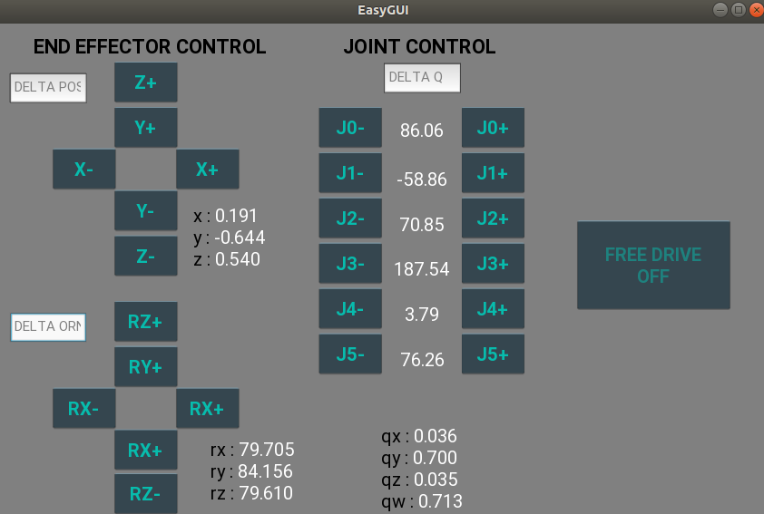

# easy_ur

easy_ur is a ROS package to control Universal Robots in a very simple, yet allowing for . (tested on UR5e, should work on any UR robots that support RTDE communication)  

## Installation
[ur_rtde](https://gitlab.com/sdurobotics/ur_rtde) - for controlling and receiving data from the robot using the Real-Time Data Exchange (RTDE) Interface

```
pip3 install ur_rtde

```
Scipy
```
pip3 install scipy
```
Install kivy for the GUI
```
pip3 install "kivy[base]"
```

If you are using an older version of ROS that comes eith python2.7 (such as ROS Melodic), install rospy for Python3
```
pip3 install rospkg
```

Clone this package into your workspace, and catkin_make it

## Usage
Make sure you have setup the UR robot correctly.

Set the UR robot into remote control mode from the Teach pendant

After starting `roscore`, run the following to start connection with the robot
```
python3 easy_ur/src/ur_rtde.py
```
This ROS node will start communication between the PC and robot using RTDE and expose the data and control streams as ROS topics and services listed below.

### Published topics
	- ur_pose - PosStamped 
	- ur_joints
### Subscribed topics
	- ur_servo_cmd

### Services
	- ur_mode_cmd
	- ur_speed_cmd
	- ur_stop_cmd
	- ur_acceleration_cmd
	- ur_pose_cmd
	- ur_joints_cmd
	- ur_joint_acceleration_cmd
	- ur_joint_speed_cmd


You can either use these topics/ services to control the robot using ROS, or use the simplified [`examples/easyUR.py`](examples/easyUR.py) which has all the helper functions in either ROS or your Python scripts.

See [`examples/examples.py`](examples/examples.py) for more detailed usage.

### GUI tools.

The robot can also be controlled using the GUI  by running

```
python3 easyGUI.py
```


The end effector position, individual joint positions and the Free Drive mode can be controlled from the GUI running simultaneously. 