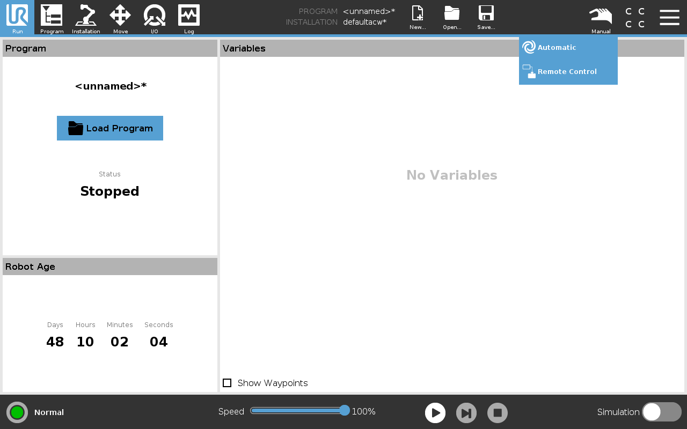

# easy_ur

easy_ur is a ROS package to control Universal Robots in a very simple, yet allowing for very flexible control. (tested on UR5e, should work on any UR robots that support RTDE communication)

Even though easy_ur runs in ROS, it does not use the UR_ROS_Driver nor Moveit for motion control.

The node comminicates with robot hardware using the Real-Time Data Exchange (RTDE) Interface. The inverse kinematics, dynamics, trajectory generation and interpolation is handled inside the UR robot itself. This reduces the complexity on the remote PC side but requires the Payload, TCP etc to be properly set in PolyScope. 

It is also flexible enough to do interpolation and generate custom trajectories in the PC and then send it to the robot in real time. This can come handy in sitations such as servoing control, or integrating robot motion in a closed loop control with some other sensors.


## Installation
[ur_rtde](https://gitlab.com/sdurobotics/ur_rtde) - for controlling and receiving data from the robot using the RTDE Interface

```
pip3 install ur_rtde

```
Scipy
```
pip3 install scipy
```
Install kivy for the GUI
```
pip3 install "kivy[base]"
```

If you are using an older version of ROS that comes eith python2.7 (such as ROS Melodic), install rospy for Python3
```
pip3 install rospkg
```

Clone this package into your workspace, and catkin_make it

## Usage
Make sure you have setup the UR robot correctly. This includes

	- Setting the Payload in Polyscope
	- Setting the End Effector TCP in Polyscope
	- Enabling the Remote Control mode.
	- Setting up the network, IP addresses etc

Set the UR robot into **Remote Control** mode from the top right corner of the Teach pendant as in following image:



After starting `roscore`, run the following to start connection with the robot
```
python3 easy_ur/src/ur_rtde.py
```
This ROS node will start communication between the PC and robot using RTDE and expose the data and control streams as ROS topics and services.


The [`examples/easyUR.py`](examples/easyUR.py) library has the UR class and helper functions to  communicate with these ROS topics/services.

See [`examples/examples.py`](examples/examples.py) for more detailed usage.

### Example move end effector

```python
from easyUR import UR

#initialize the robot object
robot=UR()

#get the current position(in meters) and orientation ( in quaternion in order x,y,z,w)
current_position, current_orientation = robot.get_pose()

#increment x axis by 5 mm
next_position = [current_position[0]+0.05, current_position[1], current_position[2]]

#move the robot
robot.set_pose(next_position, current_orientation)

```
### Example move joints

```python
from easyUR import UR

#initialize the robot object
robot=UR()

#get the joint positions
joint_poses = robot.get_joint_positions()

#increment the last axis
next_q = joint_poses
next_q[5] = next_q[5] + math.radians(20)

#set joint positions and move robot
robot.set_joint_positions(next_q)

```

### Example servoing

Servoing mode enables to send end effector poses in real-time to the robot controller.
This poses are then used in the high speed internal control loop of the robot. 

Play around with the `t_delay` (should be less than 0.1s to keep up with the robot controller) and `interp_distance` to get more intuition. 

```python
from easyUR import UR

#initialize the robot object
robot=UR()

#get current pos
current_position, current_orientation = robot.get_pose()
#increment x axis by 10 mm
next_position = [current_position[0]+0.1, current_position[1], current_position[2]]

#estimate distance between the start and end points
dist = np.linalg.norm(np.array(current_position)-np.array(next_position))

#calculate the number of points between start and end points
#  using an interpolation distance of 0.5mm
interp_distance = 0.00055
num_points = int(dist/interp_distance)

#generate a linear trajectory of points which are spread apart at interpolation distance
# between the start and end points
lin_path = np.linspace(current_position,next_position,num_points)

step_count=0
t_delay=0.05
print("Num_points Servo= ", num_points)

while step_count<num_points:
	#send comands to the robot
    robot.servo(lin_path[step_count],current_orientation)
	#wait for the robot control loop to catch up
    time.sleep(t_delay)
    step_count=step_count+1

    print("servo move ", step_count)
	#this can be any condition ( like an external sensor interrupt)
	#here we are  stopping before the full execution of the trajectory

    if(step_count==120):
        time.sleep(t_delay)# use delay before breaking
        print("breaking")
        break

```
### GUI tools.

The robot can also be controlled simultaneously using the GUI by running

```
python3 easyGUI.py
```


The end effector position, individual joint positions and the Free Drive mode can be controlled from the GUI running simultaneously. It also displays the current end effector position, orientation ( in intuitive Euler angles as well as quaternions) and joint positions.

### API

#### easyUR.py

##### `UR()` class

##### `set_pose(pose, orn, async=False)`

##### `get_pose()`

##### `set_ee_speed(speed)`

##### `set_ee_acceleration(acceleration)`

##### `set_joint_speed(speed)`

##### `set_joint_acceleration(acceleration)`

##### `get_joint_positions()`

##### `set_joint_positions(joint_cmd, async=False)`

##### `stop()`

##### `set_mode(mode)`

##### `freedrive(val)`

##### `servo(pos, orn)`


#### ur_rtde.py

##### Published topics
	- ur_pose 
	- ur_joints
##### Subscribed topics
	- ur_servo_cmd

##### Services
	- ur_mode_cmd
	- ur_speed_cmd
	- ur_stop_cmd
	- ur_acceleration_cmd
	- ur_pose_cmd
	- ur_joints_cmd
	- ur_joint_acceleration_cmd
	- ur_joint_speed_cmd

